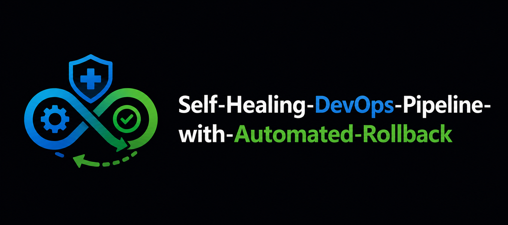

<div align="center">

 
<br><br>
<h3>DevOps Pipeline using GitHub Actions & Docker</h3>


<br><br>

<b>Micro Project - DevOps</b><br>
Alliance University, Bengaluru

</div>

---

## 📖 Project Overview

This project demonstrates an **Automated Rollback Mechanism** for failed deployments in a DevOps CI/CD pipeline using **GitHub Actions** and **Docker**.

The system automatically detects deployment failures through health checks and restores the last stable version of the application without manual intervention. This helps improve reliability, reduce downtime, and ensure continuous application availability.

---

## 🎯 Problem Statement

**Analyze and create an Automated Rollback Mechanism for failed deployments in DevOps pipelines.**

Frequent deployments can introduce failures due to bugs, configuration issues, or runtime errors. Recovering manually from such failures increases downtime and operational effort. This project addresses the problem by implementing a fully automated rollback workflow.

---

## 🛠️ Technologies Used

<table>
<tr>
<th>Technology</th>
<th>Purpose</th>
</tr>

<tr>
<td>GitHub Actions</td>
<td>CI/CD Pipeline Automation</td>
</tr>

<tr>
<td>Docker</td>
<td>Application Containerization</td>
</tr>

<tr>
<td>Docker Compose</td>
<td>Container Deployment</td>
</tr>

<tr>
<td>Node.js</td>
<td>Backend Runtime</td>
</tr>

<tr>
<td>Express.js</td>
<td>Web Application Framework</td>
</tr>

<tr>
<td>Git & GitHub</td>
<td>Version Control</td>
</tr>

<tr>
<td>Curl</td>
<td>Health Check Validation</td>
</tr>

</table>

---

## 🏗️ System Architecture

```text
Developer Pushes Code
          │
          ▼
GitHub Repository
          │
          ▼
GitHub Actions Pipeline
          │
          ▼
Build Docker Image
          │
          ▼
Deploy Application
          │
          ▼
Health Check
          │
     ┌────┴────┐
     │         │
 Success    Failure
     │         │
     ▼         ▼
 Stable    Rollback
 Version   Triggered
     │         │
     └────┬────┘
          ▼
 Application Running
```

---

## ⚙️ CI/CD Workflow

### 1️⃣ Code Push

Whenever code is pushed to the `main` branch, GitHub Actions automatically starts the workflow.

### 2️⃣ Docker Image Build

```bash
docker build -t rollback-app:latest .
```

### 3️⃣ Deployment

```bash
docker compose up -d
```

### 4️⃣ Health Check

```bash
curl http://localhost:3000
```

### 5️⃣ Failure Simulation

```bash
curl http://localhost:3000/crash
```

This intentionally crashes the application to test rollback functionality.

### 6️⃣ Automated Rollback

If the health check fails:

- Failed container is stopped
- Stable version is restored
- Application is redeployed automatically

### 7️⃣ Verification

```text
Version 1 - App is Working
```

---

## 📊 Workflow Execution Results

### ✅ Successful Deployment

```text
Version 1 - App is Working
```

---

### ❌ Failed Deployment

```text
curl: (52) Empty reply from server
```

---

### 🔁 Rollback Verification

```text
Rollback triggered...
Version 1 - App is Working
```

---

## 🔥 Key Features

<ul>
<li>Automated CI/CD Pipeline</li>
<li>Docker-based Deployment</li>
<li>Health Check Validation</li>
<li>Failure Detection</li>
<li>Automatic Rollback</li>
<li>Zero Manual Recovery</li>
<li>GitHub Actions Integration</li>
</ul>

---

## 📈 Benefits

✅ Reduced Downtime

✅ Improved Reliability

✅ Faster Recovery

✅ Automated Deployment Validation

✅ Real-World DevOps Practice

---

## 📚 Learning Outcomes

Through this project, the following concepts were implemented and understood:

- CI/CD Pipeline Design
- GitHub Actions Workflow Automation
- Docker Containerization
- Health Check Monitoring
- Deployment Failure Handling
- Rollback Strategies
- DevOps Best Practices

---

## 🔮 Future Enhancements

- Docker Hub Integration
- AWS Deployment
- Kubernetes Support
- Blue-Green Deployment
- Canary Deployment
- Monitoring with Prometheus & Grafana

---

## 👨‍💻 Author

<b>ES Sriram</b>

B.Tech – Computer Science & Engineering (Cloud Computing)

Alliance University, Bengaluru

<br>

<a href="https://github.com/Sri-Ram-git">

</a>

---

<div align="center">

⭐ If you found this project useful, consider starring the repository.

</div>
